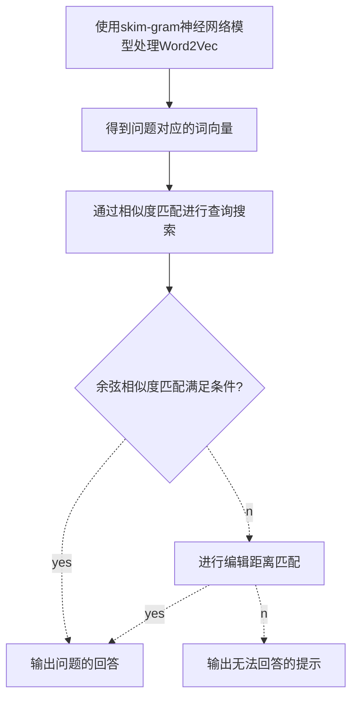

# 北京理工大学虚拟聊天机器人设计报告

---

目录

[toc]

小组成员及分工
姓名|学号|负责模块|联系方式
--|--|--|--
周彦翔|1120191286|负责视觉部分|
魏慧聪|1120191866|负责语音识别部分|
张  驰|1120191600|负责问答系统部分|18810575675 1061823234@qq.com
徐幸波|1120191232|负责虚拟形象部分|

## 视觉部分

### 问题概述

​	视觉部分的需求是从摄像机中读取图像，然后判断该图像中是否有人物出现。该人物必须面朝机器人且注视机器人，否则将被视作仅从机器人面前经过而非想要和机器人交互。

### 问题分析

​	本问题的核心是如何判断图像中的人物面朝机器人并且注视机器人，经过考虑本部分使用卷积神经网络来进行实现。

​	一开始我通过修改YOLOv5的代码，然后简单地调用接口api实现了上述功能。但是我觉得这没有意思，不能将自己所学的知识加以运用。于是我通过网上的视频教程学习了北京邮电大学鲁鹏副教授的研究生课程计算机视觉与深度学习，同时也通过另外一名up主的Pytorch视频教程学会了Pytorch的基本用法。计算机视觉与深度学习这门研究生课程的学习加深了我对神经网络的理解，并掌握了处理图像用的卷积神经网络的更多细节。

​	这些学习花费了我大概三周的时间，之后我又需要准备几门专业课的考试所以无暇开始这项工作，所以最后剩余给我调整超参数、训练模型、改进不足的时间所剩无几，但我仍希望能尽量达到更好的效果并进行了诸多的尝试。

### 模块功能概述

​	本模块运行在一个独立的进程中。模块的状态置为没有人出现并注视。

​	然后模块会从机器人的摄像机中读取图像，经由训练好的卷积神经网络判断图像中是否有人物出现并注视机器人。由于卷积神经网络并非能准确判断，所以引入假设检验来提高判断准确率。将判断的结果与现有的状态比较，若相同则不做任何处理，若不同则会修改状态并往公共消息队列中发送最新的状态。重复上述过程。

​	运行在其他进程中的其他模块会去读取公共消息队列并根据公共消息队列中的最新状态采取不同的行动。


### 卷积神经网络的实现

#### 收集数据并搭建数据集类

​	为了使网络有良好的表现，一共收集16,461张正视摄像头的人像图像用作识别正确的部分和5,468张室内场景图像用作识别错误的部分。

​	数据集结构为：

>dataset
>
>+ True
> + img1
> + img2
> + ...
>+ False
> + img1
> + img2
> + ...

​	通过继承Pytorch中的`Dateset`类构建自己的`dataset`类，命名为`MyDataset`。该数据集类把所有数据中的前80%划作训练集，后20%划作测试集。

​	同时`MyDataset`中还有`train`和`transform`两个参数，前者负责设置该`MyDataset`实例是作为训练集还是测试集，后者负责对从`MyDataset`实例中取出的图像做对应的变换。

#### 搭建卷积神经网络

​	因为此次卷积神经网络的任务是一个二分类问题，任务本身比较简单，所以不设置较深较宽的网络结构。

​	网络结构采用如下设置：

1. 卷积层，输入通道数为3，输出通道数为32，卷积核大小为5x5，边缘采用0填充。
2. 最大值池化层，池化核为2x2。
3. 卷积层，输入通道数为32，输出通道数为32，卷积核大小为5x5，边缘采用0填充。
4. 最大值池化层，池化核为2x2。
5. 卷积层，输入通道数为32，输出通道数为64，卷积核大小为5x5，边缘采用0填充。
6. 最大值池化层，池化核为2x2。
7. Flatten层，将向量展平。
8. 全连接层，输入为4096维向量，输出为64维向量。
9. ReLU层，用作上层全连接层的激活函数。
10. 全连接层，输入为64维向量，输出为2维向量。


​	其中卷积层的作用是提取图像中的各种有用的数据，通过多层卷积层后能够提取出图像中高维的信息。相比于直接使用不经任何处理的图像进行学习的网络，卷积神经网络能大幅提高网络训练的效率并减小网络的规模。

​	池化层的作用也是抽取数据，缩小数据规模的同时保留原数据中的主要特征。Pytorch中的池化层同时兼顾取最值和降采样的效果，取最值可以保留原数据中的主要特征，而降采样便于后面的卷积层提取出更高维的数据特征。

​	Flatten层的作用是将经过三层卷积层和三层池化层后的64x8x8的向量展开变成4096维向量。

​	全连接层相当于神经网络中的整合函数，负责对数据进行加权求和并加上偏置值。

​	ReLU层则是神经网络中的激活函数，其函数形式如下所示。
$$
f(x) = 
max(0, x) =
\left \{ 
\begin{array} \left
x  & x \ge 0
\\
0 & x<0
\end{array}
\right .
$$

​	Sigmoid函数的导数在大于10或者小于-10的地方的局部梯度都接近于0，不利于网路梯度的传递，在训练过程中可能会引起梯度反向传播时梯度消失。相比于Sigmoid函数，ReLU函数能让梯度流更加流畅，训练过程收敛更快。

#### 卷积神经网络训练的预备工作

​	由于任务是二分类，所以训练使用交叉熵作为损失函数，使用随机梯度下降作为优化器，使用`DataLoader`加载数据集。通过对`DataLoader`的batch size的设置，实际上的优化算法应该等价于小批量梯度下降算法。

​	接下里进行对超参数的设置。

##### batch size的设置

​	先设置`DataLoader`的batch size，让学习率保持0.0001（较低的学习率可以保证网络很难达到过拟合，更方便观察batch size对网络训练过程的影响），batch size从32开始，每次加上32，观察网络的训练情况。

| batch size | 训练结果                                                     |
| ---------- | ------------------------------------------------------------ |
| 32         |  |
| 64         |  |
| 96         |  |
| 128        |  |
| 160        |  |
| 192        |  |
| 224        |  |
| 256        |  |

​	由于时间原因，每个batch size的实验只能进行一次，实验所得数据有很大的偶然性和不稳定性。但也能从这些数据中看出这样的趋势：batch size越大，小批量梯度下降算法就越不容易过拟合。当batch size较小时，即使学习率设置为0.0001，网络权值在训练到60轮左右的时候就会过拟合；而batch size增加后，300轮的训练也不能看到网络权值的过拟合。

​	查阅资料后得知，大的batch size有如下好处：

+ 提高内存利用率，增加矩阵乘法的并行效率。
+ 一次epoch中需要的迭代次数减少，加快处理速度。
+ 在一定范围内，batch size越大，它所确定的梯度下降方面就越准确，训练的振荡就越小。可以从上述数据中发现当batch size为32时，测试集的准确率在过拟合前就有振荡，而随batch size增大，准确率的振荡幅度越来越小。

​	但是batch size也不是越大越好的，盲目增大batch size会导致网络的训练容易过早陷入局部最优，泛化性较差。

​	因为我设置的epoch总计300轮，综合考虑过拟合与欠拟合后选择256作为batch size的值。

##### learning rate的设置

保持batch size为256，让learning rate从0.0001开始，每次增加0.0002，观察网络的训练情况。

| learning rate | 训练结果                                                     |
| ------------- | ------------------------------------------------------------ |
| 0.0001        |  |
| 0.0003        |  |
| 0.0005        |  |
| 0.0007        |  |
| 0.0009        |  |

观察后发现，网络在learning rate为0.0003到0.0007之间时训练效果较好，于是选择learning rate为0.0005。


#### 卷积神经网络训练

​	卷积神经网络的训练环境为

> 硬件配置：
>
> | 名称 | 型号         |
> | ---- | ------------ |
> | CPU  | i7-9750H     |
> | GPU  | GTX1660ti 6g |
> | RAM  | 16G 2133MHz  |

> 软件环境：
>
> | 名称        | 版本            |
> | ----------- | --------------- |
> | 操作系统    | Windows10 2021H |
> | python      | 3.8.12          |
> | pytorch     | 1.10.0          |
> | tensorboard | 2.6.0           |
> | torchvision | 0.11.1          |
> | numpy       | 1.21.2          |
> | opencv      | 4.0.1           |

设置batch size为256，设置learning rate为0.0005，设置epoch为200。

重复10次训练，选择测试集上准确率大于80%的模型，然后将其放入写好的模块中的对应部分。

#### 卷积神经网络的不足和可能的改进措施

##### 出现的问题

​	将训练得到卷积神经网络模型放到模块中并尝试运行，发现如下两个问题：

+ 只有当人脸出现在摄像机中间位置并距离摄像机较近网络才能识别到有人出现。
+ 当人脸倾斜超过一定的角度后网络会识别不出有人出现。
+ 当人静止在摄像机前，即保证输入的图像基本不变时，网络会一会儿输出有人出现，一会输出没有人。

##### 问题产生的原因

​	对上述问题分析后，大致确定如下几个可能导致这些问题的原因：

+ 数据集不够强，所有的人脸图像几乎都是正朝相机且占据图像的大部分区域，人脸基本没有倾斜或者只占图像一小部分的情况。这导致网络学习到的都是类似这样的图像的模板，所以会出现第一二点问题。
+ 网络的边界依然不够明显，虽然已经使用交叉熵而非MSE作为损失函数，但是依然不能很好的区分开部分在边界附近的图像

##### 可能的解决方法

​	经过思考，我认为有如下几种解决方法：

+ 在实际使用中，对输入的图像划分出可能有人脸的候选区域，将这些候选区域输入网络中，然后观察网络的输出中是否有有人出现，若有，则说明有人出现；若全为false，则说明这张图像中没有人脸出现。

  但这种方法也存在问题，例如如何划分出候选区域，如何保证候选区域中一定包括目标人脸。

  结合所学并查阅相关资料后总结了如下几个获取候选区域的方法：

  1. 滑动窗口

     滑动窗口即暴力搜索每个大小每个地方的可能区域，实际上就是暴力搜索。

     这种方法效率太低，不予考虑。

  2. 选择运动的区域

     借鉴数字图像处理中的方法，选择视频相邻两帧之间的图像变化区域作为候选区域，把梯度方向、强度相似且位置相邻的区域作为同一个候选区域。

     我认为可行，但问题是可能存在摄像机晃动的情况，此时整个图像都将作为候选区域，这会导致错误的结果。

  3. 使用聚类算法

     使用k-means或者谱聚类把相似且位置相邻的区域作为一个候选区域。

+ 可以尝试使用自适应梯度法去训练，同时增加训练的epoch次数，让网络的边界更明晰。

  但是更过的epoch次数可能让网络训练到一定次数后过拟合，之后的训练都是无效训练。可以尝试在网络中添加随机失活层来让网络不那么快过拟合。

### 假设检验

由于网络的结果存在和真实情况之间存在误差，所以希望借助假设检验的办法来减小误差。通过记录前6次网络输出的结果，把这些结果作为样本进行假设检验。

由于假设检验过于复杂，此处采用简化的统计方法，只要这6次中网络认为有人出现的次数大于等于5次，那么就认为此时有人；相反，只要这6次中网络认为没有有人的次数大于等于5次，那么就认为此时没有人。

## 语音识别部分

### 接口说明

基本实现了神经网络训练下的语音与音译的转换，但是转换文字的过程中采用的隐马尔可夫效果并不是特别好，与问答系统的对接就不是特别理想，为了方便整个系统运行，最终采用讯飞开放平台的语音转写api，该功能基于深度全序列卷积神经网络框架，通过 WebSocket 协议，建立应用与语言转写核心引擎的长连接，将连续的音频流内容实时识别返回对应的文字流内容。

而本地运行的全序列卷积神经网络（与讯飞语音识别的网络结构几乎一致）识别代码构建也在下面做了说明。

### 深度全序列卷积网络架构

深度全序列卷积神经网络（DFCNN）的网络结构如下：


<center>图 1  DFCNN框架结构图</center>

其中，DFCNN直接将一句语语音转化成一副语谱图作为输入。首先对音频片段每帧进行傅里叶转换、取对数，将时间和频率作为图像的两个维度，可以得到一副语谱图。


<center>图 1  语谱图特征图例</center>

用 3*3 的卷积核对语谱图做卷积。卷积层输出 32 特征。卷积神经网络中的卷积核大小为（3，3），提取32个特征，扩充padding为 1，卷积步长为1，则一次卷积后图像的尺寸变为（n，n）。卷积神经网络可以充分利用语谱图像图像的2D结构，每个输出都通过所有位置的滤波卷积生成。卷积后会生成一个非线性变化单元。
$$
\psi(x)=
\begin{cases}
x; x≥0
\\0; x≤0
\end{cases}
$$
这里会引入最大池化步骤，通过平均感受野的语谱图特征，提取最重要的特征信息。池化层的主要作用是避免噪音等无关紧要的特征，提取处最大参数，减少参数数量，输出 64 特征，使维度减半。


<center>图 2  最大池化结构示意图</center>

此时数据的两个维度减半，再通过一次卷积和池化过程，特征值变为 128 。最后接入全连接层。全连接层的每一个神经元都与前一池化层的所有神经元连接，激励函数使用 $Relu(x) = max(0,x)$ ，最后一层的输出值用softmax进行分类

虽然卷积神经网络早就应用于语音识别系统当中，但很长一段时间内都只能使用固定长度的帧拼接作为输入，不能看到足够长的上下文信息。可以看出，深度全序列卷积神经网络使用了大量的卷积层对整句语音信号进行建模，更好的表达了语音的长时相关性。

### 全序列卷积神经网络代码构建

网络训练所用数据集为清华大学的 THCHS-30 中文语料库，构建的代码文件为voicetotext.py

#### 语音文件与时频图的转换

要用全序列卷积神经网络去识别一段语音，首先要将语音转换成时频图提取图中特征进行处理，用 scipy 计算库得出音频的采样率和波形信息，经过傅里叶转换和取对数后，在汉明窗绘制时频图


#### 发音词典构建

接下来遍历所有的标注文件，统计出发音词典序列并标注序号，这样可以用数字序列来表示音频内容，从而进一步转换为发音序列。可以得到音频文件和标注共13388组，每组对应一句话，字典中共有1209个发音。

例如训练集中的第一个文件对应的文本内容为“绿 是 阳春 烟 景 大块 文章 的 底色 四月 的 林 峦 更是 绿 得 鲜活 秀媚 诗意 盎然”，得到的数字序列和发音序列如下：


#### 音频文件处理

全序列卷积神经网络算法中声学模型有3个 maxpoling 层，每个维度需要被8能够整除

```python
# wav_lst存储了所有音频文件路径，这是处理第一个音频文件时频的操作
fbank = compute_fbank(wav_lst[0])  # compute_fbank时频转化的函数在前面已经定义好了
fbank = fbank[:fbank.shape[0] // 8 * 8, :]
```

处理前的频谱图大小为777 * 200，处理后为776 * 200

#### 数据生成

从13388组中随机选取10000组，每次切片随机取其中四组作为一个batch_size，构成一个tensorflow块，因此四组时频图的大小必须保持一致，在处理时应该适当延长长度较短的时频图。每一组时频图的处理如下：

```python
# 输入序列经过卷积网络后，长度缩短了8倍，因此我们训练实际输入的数据为wav_len//8（网络结构导致）。
def wav_padding(wav_data_lst):
    # 获得四个音频文件时频图的长度
    wav_lens = [len(data) for data in wav_data_lst]
    # 取出最大一个
    wav_max_len = max(wav_lens)
    # 将长度缩短8倍
    wav_lens = np.array([leng // 8 for leng in wav_lens])
    # 列为wav_max_len可保证全部数据都能存下且每个时频文件数据存储格式相同
    new_wav_data_lst = np.zeros((len(wav_data_lst), wav_max_len, 200, 1))
    for i in range(len(wav_data_lst)):
        # 将第i个时频图数据放入第i行的0~wav_data_lst[i].shape[0]列
        new_wav_data_lst[i, :wav_data_lst[i].shape[0], :, 0] = wav_data_lst[i]
    return new_wav_data_lst, wav_lens
```

构建 CNN+DNN+CTC声学模型，模型将卷积神经网络与深度神经网络融合，使用ReLU激活函数和CTC损失函数


### 结果预测

10轮训练迭代过后的损失函数


20轮迭代之后


40轮迭代之后


损失函数已经收敛到了一个较小的值，用训练的模型测试效果：


可以看出准确率的确很高。

### 与问答系统组合后的演示结果


启动后等待人声，‘Me’显示的是使用者说话后转换成文字的序列，ChatBot表示问答系统的输出，同时有人声输出。

## 问答系统部分

整体思路如下：

首先提出AIML的自定义对话模板，录入各种对话的模板供问答系统来进行使用。之后在进行训练时，将问答语句中的问题转换成词向量的形式，通过skip_gram的神经网络模型训练word2vec。

之后将训练好的word2vec模型录入，将用户输入的问题语句字符串也同样进行向量化处理。处理后，我们先采用余弦相似度匹配的算法进行匹配，查看是否有相应的余弦相似度模板，如果余弦相似度匹配找到了相对应的问题，则输出相对应问题的答案。如果余弦相似度的匹配无法满足要求，那么就根据编辑距离匹配的方式，在问答系统的模型中寻求问题的结果。编辑距离的相似度如果仍旧过低，那么问答系统输出“这个问题我不知道如何回答哦~”。

问答系统中的简易框架如下图所示：



### AIML自定义对话模板

AIML是用于描述一类称为AIML的对象，同时部分描述了计算机程序处理这些对象时的表现。AIML是XML语言（可扩展标记语言）的衍生。

AIML对象是由topic和category单元组成的，格式化或未格式化的数据均可。格式化的数据是由字符组成的，其中有的组成符号数据，有的构成AIML元素。AIML元素将应答数据封装在文档中。包含这些元素的字符数据有可能被AIML解释器格式化，也有可能在之后的响应中处理。

AIML文档中的对话文件以.aiml格式判断，可以用于替换问答系统中输出的语句，用于定义相对应的对话模板。文件部分展示如下图所示：


本文的aiml对话定义模板包含以下几个文件，其中bye.aiml其中包含的是有关再见的对话模板，Common_conversation包含的是有关于日常对话的模板语句，其余也是同样的相关对话模板


加载相关模板规则的python文件位于：matcher/rules/aimlMatcher.py 与matcher/rules/rulesMapper.py 文件中,代码如下：

```python
def add_rules():
    rule_path = os.getcwd()
    mybot = aiml.Kernel()

    # 加载aiml规则模板
    mybot.learn(rule_path + '/matcher/rules/Common_conversation.aiml')
    mybot.learn(rule_path + '/matcher/rules/bye.aiml')
    mybot.learn(rule_path + '/matcher/rules/tuling.aiml')

    mybot.learn(rule_path + '/matcher/rules/tools.aiml')
    mybot.learn(rule_path + '/matcher/rules/bad.aiml')
    mybot.learn(rule_path + '/matcher/rules/funny.aiml')
    mybot.learn(rule_path + '/matcher/rules/OrdinaryQuestion.aiml')
    mybot.learn(rule_path + '/matcher/rules/persionname.aiml')

    return mybot

def get_rules():
    mybot = add_rules()
    return mybot
```

### 使用skip-gram神经网络模型训练Word2Vec

skip-gram模型的输入时一个单词wi，他的输出时wi的上下文，上下文的窗口大小为C。skip-gram的神经网络模型如下图所示：


skip-gram的神经网络模型是从前馈神经网络模型改进来的，在下图中，输入向量x代表某个单词的one-hot编码，对印的输出向量。输入层与隐藏层之间的权重矩阵W的第i行代表词汇表中第i个单词的权重。这个权重矩阵W就是我们需要学习的目标（同W′），因为这个权重矩阵包含了词汇表中所有单词的权重信息。上述模型中，每个输出单词向量也有个$N \times V$维的输出向量W′。最后模型还有NN个结点的隐藏层，我们可以发现隐藏层节点$h_i$的输入就是输入层输入的加权求和。因此由于输入向量x是one-hot编码，那么只有向量中的非零元素才能对隐藏层产生输入。


之后通过反向传播的算法以及随机梯度下降来学习权重矩阵W，第一步即定义损失函数，损失函数为输出单词组的条件概率，$E=-log_p(w_{o,1},w_{o,2},...,w_{o,C}|w_{I})$,之后团队损失函数求导，得到权重矩阵的更新规则：
$$
w(new)=w_{ij}(old)-\eta(\sum_{j=1}^{V}\sum_{c=1}^{C}(y_{c,j}-t_{c,j})\times w_{ij}^{'}\times x_j)
$$
在代码中，我们使用python中的gensim库的Word2Vec中，调取相关参数如下所示：

```python
from gensim.models import Word2Vec
logging.basicConfig(format='%(asctime)s: %(levelname)s: %(message)s')
    logging.root.setLevel(level=logging.INFO)
    inp, outp1, outp2 = corpus_path, path + 'model/all.zh.text.model', path + 'model/all.zh.text.vector'
    model = Word2Vec(LineSentence(inp), size=200, window=5, min_count=2,
                     workers=multiprocessing.cpu_count())
    model.save(outp1)
```

### 句子词向量的余弦相似度匹配法

词向量可以表示单词间的内在联系，即两个单词的词向量通过计算可以得出其关联程度，根据上面使用skip-gram的方法，将用户的提问使用word2vec的方法转换成词向量的方式。根据词向量与训练模型库词向量的相似度，依据相似度的大小对句子间的余弦相似度进行匹配。我们采用余弦相似度的比较方式，两个向量直接余弦相似度公式如下：
$$
cos(\theta)=\frac{\sum_{i=1}^{n}(X_i \times Y_i)}{\sqrt{\sum_{i=1}^{n}(X_i)^2}\times\sqrt{\sum_{i=1}^{n}(Y_i)^2}}
$$
显然，两个特征的余弦相似度计算出来的范围为[-1，1]。当两个单词向量的余弦相似度夹角为0度时，即余弦相似度为1时，表示向量X和向量Y应该是最相似的；夹角为90度是余弦相似度为0，表示向量X与向量Y无关。

我们根据句子词向量之间的相似度，来判断问题之间的相似性，相似性越高。根据相似性匹配问题，从训练集中寻找问题的回答。

余弦相似度的匹配算法位于matcher/rules/vectorMatcher.py函数中，加载pre-trained词向量模型，将句子进行向量化，将用户的输入转化为向量来表示，通过加权平均的方式进行向量化，向量化后可以进行距离的匹配。距离匹配位于chat.py中：

```python
 vec_model = vectorMatcher.load_w2vModel()
 cosine_sim = vectorMatcher.match(inputs_seg, sent_vec, vec_model)
 try:
            # 保留余弦相似度top10
            response_frame = sent_vec.sort_values(by='cosine', ascending=False)[:10]
            # print response_frame
        except:
            response_frame = None

```

在这里运用到了搜索与问题求解的相关知识，即将问答系统中问题的回答分为两方面，一方面是基于余弦相似度的匹配，一方面是基于编辑距离匹配，两者中只要有一种方式可以进行求解，得到相应的问题解决方案即可。即在与或图的处理中，余弦相似度和编辑距离相似度匹配的解决方法是或的关系。

之后保留前十的余弦相似度，在保留时如果相似度大于0.6，则输出相似性最高问题的回答，如果小于等于0.6，则根据编辑距离匹配的方法，求相似度最高的回答秒如果仍小于限定值，则输出：“这个问题我不知道如何回答哦~”


### LevenshteinMatcher编辑距离匹配的方法

Levenshtein 距离，又称编辑距离，指的是两个字符串之间，由一个转换成另一个所需的最少编辑操作次数。编辑距离用于模糊查询和数据匹配效果较好，许可的编辑操作包括将一个字符替换成另一个字符，插入一个字符，删除一个字符。

即S1、S2表示两个字符串，S1(i)表示S1的第一个字符，d[i, j]表示S1的第i个前缀到S2的第j个前缀（例如:S1 = ”abc”,S2 = ”def”,求解S1到S2的编辑距离为d[3, 3]）。

这里采用python中的Levenshtein库，来实现编辑距离匹配的方法：

```python
from Levenshtein import *
def acquaintance(a,b):
    for i in a:
        item = {}
        for j in b:
            if ratio(u"%s"%i,u"%s"%j):
                item[ratio(u"%s"%i,u"%s"%j)] = (i,j)
        d = item[max(list(item.keys()))]
        c = '"%s"和"%s"-最相似---匹配度为：%f'%(d[0],d[1],max(list(item.keys())))
        print(c)
```

得到两个字符串的编辑距离比，使用ratio可以将距离进行归一化，得到一个值，来表征两个问题之间的相似度。

### 问答系统中出现的相关问题以及改进措施

在问答系统中，仍旧会出现匹配度较低，导致无法识别问题进而会回答“这个问题我不知道该如何回答哦”。相似度匹配的结果中，我们可以得到其实大部分语句的句向量匹配相似度都低于0.5。

所以，我做出相应的改进措施是，在余弦相似度匹配之外，又加上了编辑向量相似度匹配的算法，从而增强了匹配到相应回答的概率。

在这之后，我认为，如果继续对该问题进行改进，应该对一个问题进行多种不同的解释。很多问题的回答是一样的，但是由于问法不一样，可能会导致余弦相似度匹配和编辑向量匹配算法都无法匹配到，所以，应该对同一个问题进行不同的多种描述，从而增加该问题被匹配到的几率。

> 北京理工大学招生处电话号码是多少？ 答：请您拨打010-68913345或010-68949926
>
> 麻烦你告诉我北京理工大学招生处电话号码。答：请您拨打010-68913345或010-68949926

问答系统的相关问题及改进措施如上所示。

## 虚拟形象部分

### 框架创建&路由Route

Flask是一个轻量级的基于Python的web框架，它带有一个默认的static文件夹用以存放静态文件（比如css、js、图片、视频、音频等），和一个默认的templates文件夹用以存放html模板。


1. template_folder : 指定存放模板的文件夹的名称（默认为templates）
2. static_folder : 指定存放静态文件资源的文件夹的名称（默认为static）
3. static_url_path : 指定静态文件的访问路径（默认与static_folder一致）


如上图所示，本项目采用默认配置创建了框架。
然后开始设置路由：


该语句表示如果是GET请求访问网页的话,就在浏览器上显示’index.html’页面。如果用户点击了录制提问的按钮则POST经过语音录制、分词、匹配、unk值处理等一系列步骤生成回答信息并由’index.html’（内的文本框）负责接收并显示。这里的返回’render_template’函数即是在调用templates文件夹内的html模板。

### 模板编写&虚拟形象

以下是网页界面模板：

```html
<head>  
    <meta charset="UTF-8">  
    <title>BIT智能问答系统</title>  
    <link href="../static/common.css" rel="stylesheet">  
    <style>  
        html,  
        body {  
            background: #F7EED6;  
            height: 100%;  
            width: 100%;  
            margin: 0px;  
            padding: 0px;  
            text-align: left;  
        }  
    </style>  
</head>  
<body>  
<div id="top">  
    <h1>BIT智能问答系统</h1>  
<div>  
<div id="left">  
    <h2 class="s1" style="color:#FFA700; margin-left:10px">你想问点什么？</h2>  
    <form action="/" method="post">  
        <input class="btn_a" type="submit" value="点击此键开始录音">  
    </form>  
</div>  
<div id="right">  
    <h2 style="color:#FFA700; margin-left:75px">我的回答：</h2>  
    <form action="/" method="post" class="s1" align="left">  
        <textarea rows="20" cols="50" font-size="" name="txt">{{ response }} </textarea>
    </form>
</div>

</body>

```

主要是网页的展示结构和两个控件（提问录音按钮&回答展示框）。

然后是虚拟形象的实现部分，本项目采用了最基础的L2D的默认model和动作。对于用户的操作能做出一定的回应。但局限于L2D有限的web端接口和扩展能力，目前为止并不能很好地实现原本预想的自设多个动作接口用以丰富用户交互的初衷。这部分是本项目的一个遗憾：

```html
<script type="text/javascript" charset="utf-8"  src="\static\live2d-widget.js-master\lib\L2Dwidget.0.min.js"></script>  
<script type="text/javascript" charset="utf-8"  src="\static\live2d-widget.js-master\lib\L2Dwidget.min.js"></script>  
<script type="text/javascript">  
    L2Dwidget.init(  
        {  
        "display": {  
            "superSample": 2,  
            "width": 200,  
            "height": 400,  
            "position": "right",  
            "hOffset": 520,  
            "vOffset": 0  
            },  
        "dialog": {  
            "enable": true,  
            "script": {  
                'every idle 10s': '您好，BIT智能问答系统为您服务！',  
                'tap body': '您、您好……',  
                'tap face': '欢、欢迎……'  
                }  
            }  
        }  
    );  
</script>  
</html>

```

L2Dwidget.0.min.js和 L2Dwidget.min.js是支持L2D的脚本。

（脚本源码在https://github.com/xiazeyu/live2d-widget.js.git，且在git中不能直接找到该脚本文件——L2Dwidget.min.js 脚本是需要编译生成的。

在\static\live2d-widget.js-master文件目录下通过命令cnpm install安装依赖包，然后cnpm run build:dev执行编译项目的脚本，运行完毕后lib目录生成，L2Dwidget.min.js和L2Dwidget.0.min.js脚本也成功生成。）

【L2Dwidget.init();】是初始化L2D模型的语句。默认加载的是live2d-widget-model-shizuku这个模型，在live2d-widget.js-master/src/config/defaultConfig.js中可以看到默认配置如下：

```javascript
const defaultConfig = {
  model: {
    jsonPath: 'https://unpkg.com/live2d-widget-model-shizuku@latest/assets/shizuku.model.json',
    scale: 1,
  },
  display: {
    superSample: 2,
    width: 200,
    height: 400,
    position: 'right',
    hOffset: 0,
    vOffset: -20,
  },
  mobile: {
    show: true,
    scale: 0.8,
    motion: true,
  },
  name: {
    canvas: 'live2dcanvas',
    div: 'live2d-widget',
  },
  react: {
    opacity: 1,
  },
  dev: {
    border: false
  },
  dialog: {
    enable: false,
    script: null
  }
}
```

在 src/index.js 文件中可以看到配置的说明如下：

```javascript
/**
 * The init function
 * @param {Object}   [userConfig] User's custom config 用户自定义设置
 * @param {String}   [userConfig.model.jsonPath = ''] Path to Live2D model's main json eg. `https://test.com/miku.model.json` model主文件路径
 * @param {Number}   [userConfig.model.scale = 1] Scale between the model and the canvas 模型与canvas的缩放
 * @param {Number}   [userConfig.display.superSample = 2] rate for super sampling rate 超采样等级
 * @param {Number}   [userConfig.display.width = 150] Width to the canvas which shows the model canvas的长度
 * @param {Number}   [userConfig.display.height = 300] Height to the canvas which shows the model canvas的高度
 * @param {String}   [userConfig.display.position = 'right'] Left of right side to show 显示位置：左或右
 * @param {Number}   [userConfig.display.hOffset = 0] Horizontal offset of the canvas canvas水平偏移
 * @param {Number}   [userConfig.display.vOffset = -20] Vertical offset of the canvas canvas垂直偏移
 * @param {Boolean}  [userConfig.mobile.show = true] Whether to show on mobile device 是否在移动设备上显示
 * @param {Number}   [userConfig.mobile.scale = 0.5] Scale on mobile device 移动设备上的缩放
 * @param {String}   [userConfig.name.canvas = 'live2dcanvas'] ID name of the canvas canvas元素的ID
 * @param {String}   [userConfig.name.div = 'live2d-widget'] ID name of the div div元素的ID
 * @param {Number}   [userConfig.react.opacity = 0.7] opacity 透明度
 * @param {Boolean}  [userConfig.dev.border = false] Whether to show border around the canvas 在canvas周围显示边界
 * @param {Boolean}  [userConfig.dialog.enable = false] Display dialog 显示人物对话框
 * @param {Boolean}  [userConfig.dialog.hitokoto = false] Enable hitokoto 使用一言API
 * @return {null}
 */

```

于是参照配置说明，设置dialog为true并以此作为交互方式之一。
以上是网页模板的全部内容。

### 测试运行：

测试运行图片如下：


## 整体运行结果：

整体运行视频放在附件：[演示.mp4](演示.mp4)中：
他展示了如下功能：

+ 人脸识别，识别到人脸后打招呼
+ 能进行语音的识别工作
+ 能对北京理工大学的相关问题进行回答与交流，对问题做出回应，发出声音
+ 有虚拟形象与动作

本系统综合运用了人工智能基础课程中的**机器学习、人工神经网络、搜索与问题求解**的方法，解决了大作业中的相关问题。

对实验结果的报告和分析，系统参数对结果的影响、不同方法的对比、后续如何进一步改进完善已经放在以上的各个模块的描述中，在这里不再赘述。